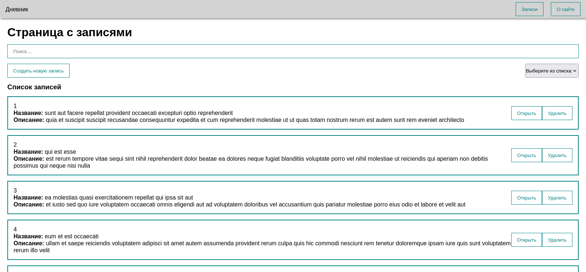

# Блокнот

### Если вы не можете запустить приложение, то скорее всего на вашем компьютере не установлены такие инструменты как Node, NPM и VUE CLI. Что бы у вас все заработало установите их.

<br>

Для начала обновите локальный индекс пакетов:
```
sudo apt update
```

Установите Node js репозиторий:
```
sudo apt install nodejs
```

Затем установите менеджер пакетов npm:
```
sudo apt install npm
```

Проверьте работоспособность программ командами:
```
nodejs -v
```

и

```
npm -v
```

Все. Осталось только установить Vue CLI:
```
npm install -g @vue/cli
```

<br><br>




